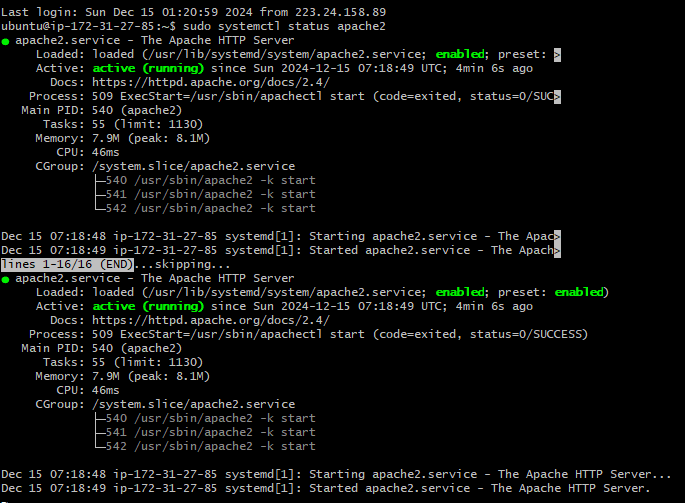
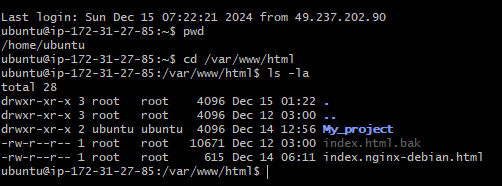
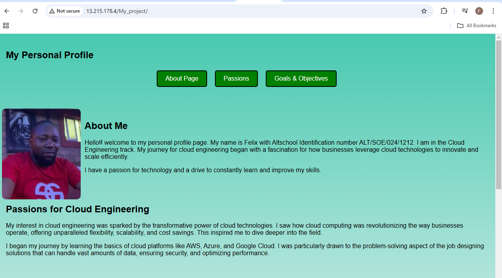

# AltSchool of Cloud Engineering Karatu '24 2nd Semester Exam Submission

## Project Overview
This project demonstrates the setup of an Apache web server on an AWS EC2 instance to serve web content. Tasks include creating an EC2 Ubuntu instance, configuring the server, transferring files, and ensuring accessibility via a public IP.

## Creating AWS EC2 Ubuntu Instance and Configuration
1. I created an AWS EC2 instance (Ubuntu 20.04 LTS).
2. Created a security group to control traffic and enable SSH into my instance via the terminal.

## Public IP Address
Access the web content using the IPV4 of my instance at:
- **http://13.215.178.4/My_project**

## Steps to Access the Web Server
1. Open a web browser.
2. Enter the following URL: `http://13.215.178.4/My_project`.

## Screenshots
Below are the screenshots demonstrating the task completion:
## Screenshots
1. **Apache Server Running**  
   
2. **Files in `/var/www/html/`**  
   
3. **Website in Browser**  
   

---

Thank you for reviewing this submission!
